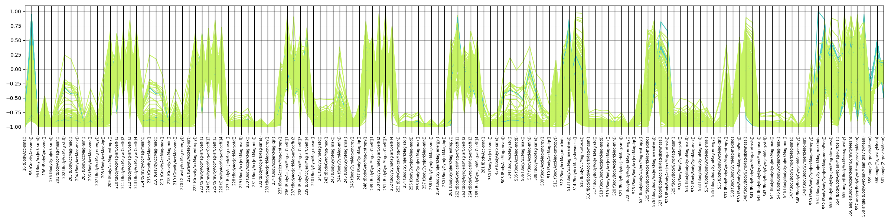

## Model 1 (deep learning model)
### <u>Data Preprocessing</u>
The preprocessing is embedded in the model and essentially aims at building a time-wise and space-wise relative representation:
- Each time series is scaled on the time axis (cf `model.model1.TimeWiseNormalisation`)
- Each feature is scaled spatially using the custom layer `model.model1.ExtractFeatRange` as well as the builtin layer `LayerNormalisation`

### <u>Feature selection</u>
This model uses the raw inertial signals as well as the relative representation mentioned above.

### <u>Model choice</u>
The architectures builds on 3 intermediate representations, which uses the raw signals as well as their relative representations:
- a 1 dimensional convolutional layer with a small window size to extract local spatial features
- a 1 dimensional convolutional layer with a large window size to extract global spatial features
- a recurring neural network to extract temporal features

Eventually a softmax operation is performed to return a score distribution, with each score corresponding to the likelihood of the subject performing the corresponding activity.

## Model 2 (non-deep machine learning model)
### <u>Data Preprocessing</u>
The engineered features being already normalized and bounded within [-1, 1], I haven't performed any additional preprocessing. I did notice that some columns in the training set do not reach the boundaries, which makes me think that it has been preprocessed taking into account the maximum/minimum observed across the training and the test sets. I'll look into this after I've submitted this assignment because if that's the case this would be unfortunate given that this is a form of data leakage.

### <u>Selected features</u>
I eventually decided not to take into account at all the axis-dependent features containing the keywords: `meanFreq`, `maxInds` or the features containing the keyword `bandsEnergy`. I acknowledge this is a large number of features (144) but the reality is that I didn't have enough time to look into what they mean. For the other features, this is what I've done:

Most of them derive from the subjects acceleration or their rotational speed. And probably because I'm not familiar with this domain, they all seem very relevant for the machine learning task at hand... I thought maybe the non-body component of the acceleration could be removed if it was not varying too much, but since features have been normalised, I couldn't get a good feel for the amplitude of its variation, and decided to keep it.

Consequently, because it was difficult to hypothesize which features were more likely to have predictive power than others, my approach has been to group them when I thought they were describing similar concepts, then to perform a form a statistical feature selection among each group.

Features which aren't an axis projection have been grouped together to form the base of the feature space (cf `features.base` in __model2.toml__).

The others have been grouped depending on how they intend to characterize the signal: location (central or non-central), dispersion, auto-correlation or shape.

Each of the 5 time domain variables and 3 frequency domain variables has multiple entries in __model2.toml__ (eg: `features.time_domain_groups.tBodyAcc_location`, `features.time_domain_groups.tBodyAcc__dispersion` etc) corresponding to these sub-groups.

Only 2 features per group are eventually kept by the model. This is controlled by the parameter `Classifier.max_extra_feat` in __model2.toml__.

### <u>Model choice</u>

I haven't formally verified the presence of colinearity in this dataset, but given the large number of variables, it is likely there is some. Because random forests are suitable in presence of correlated features, I've opted for this algorithm. Another advantage is that they are parallelisable, which is helpful to speed up hyperparameter optimisation, such as finetuning the number of trees (cf `training.hyperparameter_grid` in __model2.toml__).

## Pros and cons

|             | Deep learning model | Random Forest |
| ----------- | ------------------- | ------------- |
| Pros        | No feature engineering<br>Extensible | Better interpretability<br>Faster training |
| Cons        | Slower training<br>Need to set aside some data for the validation set | Heavy feature engineering<br>Less versatile |

## Results

Given there isn't any extreme variation between the 6 label occurrences (cf `make label-counts-test`), we don't have to worry too much about classes imbalance and it is safe to use a usual __accuracy__ metric to measure performance. This metric measures how often a model "is correct".

For example, the deep learning model is correct 93 times out of 100:

```make eval-model1```

```
Model accuracy 93.15%

                      1 WALKING  2 WALKING_UPSTAIRS  3 WALKING_DOWNSTAIRS  4 SITTING  5 STANDING  6 LAYING
1 WALKING                   463                   3                    29          1           0         0
2 WALKING_UPSTAIRS            0                 444                    27          0           0         0
3 WALKING_DOWNSTAIRS          4                   3                   413          0           0         0
4 SITTING                     0                   2                     0        400          89         0
5 STANDING                    0                   0                     0         19         513         0
6 LAYING                      0                   0                     0          0          25       512
```

While the non-deep machine learning model is correct 91 times out of 100:

```make eval-model2```

```
Model accuracy 91.45%

                      1 WALKING  2 WALKING_UPSTAIRS  3 WALKING_DOWNSTAIRS  4 SITTING  5 STANDING  6 LAYING
1 WALKING                   485                   3                     8          0           0         0
2 WALKING_UPSTAIRS           65                 398                     8          0           0         0
3 WALKING_DOWNSTAIRS         25                  58                   337          0           0         0
4 SITTING                     0                   0                     0        426          65         0
5 STANDING                    0                   0                     0         20         512         0
6 LAYING                      0                   0                     0          0           0       537
```

The matrices above are called confusion matrices and allow to look into the type of errors a model makes in more details. The diagonal are correct predictions while the upper and lower triangles are mistakes.

For example these tables tell us that:
- the non-deep machine learning model is perfectly correct at predicting the position LAYING
- the most common error for both models is to predict a STANDING position while the subject is SITTING

Let's see whether feeding the deep learning model with additional features could help to fix this type of error.

Here is a parallel coordinates plot that displays samples in the coordinate space. When the deep learning model classified a SITTING subject as a STANDING subject the trajectory is blue, while when it correctly classified a SITTING subject, the trajectory is green.

If we observe consistent differences between the two types of trajectories then we can hypothesize that the corresponding features may help to improve the representation of the erroneous samples. Typically in our case the deep learning model (which has been trained only on raw signal) may benefit from being fed with the features 559, 560 & 561, or being augmented by a transformation that can approximate these.



